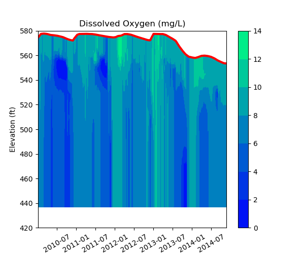

## Project Name
Lake Water Quality Visualization and Analysis Tool

## Table of contents
* [Project Description](#project-description)
* [Getting Started](#getting-started)
* [Prerequisites](#prerequisites)
* [Usage](#usage)
* [Screenshots](#screenshots)
* [License](#license)
* [Contact](#contact)

## Project Description

A collection of tools are provided to simulate and visualize 
water quality measurements using interactive figures
to inspect a lake's dissolved oxygen content and temperature.

Several figures include widget sliders to allow the user to select
a day of interest to for depth profiles of key water quality measurements
and interpolations.

Analysis is based on reading time series of surface and water depth measurements
to interpolate/extrapolate measurement profiles of key water body characteristics.

## Getting Started

### Prerequisites

The following packages are required:
* numpy
* pandas
* matplotlib
* scipy

## Usage

```
python lake_measurements.py
```

## Screenshots
Figures with slider widgets to allow user to interactively select analysis
day of interest:  
  
  

Additional lake water quality visualizations:  
  
  
  
  

## License

Distributed under the *** License. See `*** License Info ***` for more information.

## Contact

Tony Held - tony.held@gmail.com  
Project Link: [https://github.com/TonySoloProjects/lake_analyses](https://github.com/TonySoloProjects/lake_analyses)

